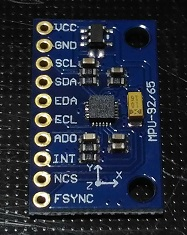
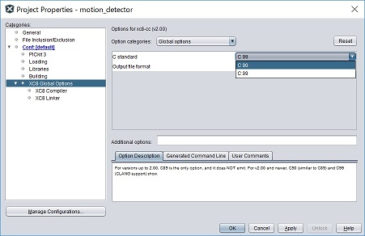

# pic16f1-mcu

In my experience over a couple of years, if you develop IoT at work, you have to __learn Physics__ before Computer Science (aka IT) or Machine Learning (aka AI) or Digital Signal Processing (DSP). Otherwise, you will end up getting no valuable data for analysis.

I graduated from Physics department some ten years ago, but I have forgetten all the theories and equations! I am relearning Physics...

## PIC16F1 as measuring instrument for learning Physics

I think PIC16F1 DIP package (14 pins, such as PIC16F18326 or PIC16F1825) is a perfect solution to develop a measuring instrument for learning Physics on my own (one exception is that STM32L476RG is perfect when audio signal processing is required).

It is very small and very cheap, but it has a lot of capabilities comparable to Arduino.

I developed my original PIC16F1 evaluation board in 2017, and I have used this board for a number of IoT demonstrations so far. When a demo is expected to be small and simple, the board is more useful than other commercial boards such as Arduino or STM32 Nucleo. The total cost of the board (~ $10) is much cheaper than Arduino Uno. I have also developed [CAN driver](https://github.com/araobp/can-bus) for 14-pin PIC16F1 MCUs.

For example, below is a hamster wheel to which a hall sensor is attached to count the number of pulses: how long a hamster runs at night.

I have also developed IoT of baby car, IoT of bus etc...

I usually use the board with RasPi or Android, but I use it as a stand-alone system for physics experiments this time.

## Motion sensor with PIC16F18326 for my bicycle

I will develop a small 9-axis sensor unit with [PIC16F18326](http://ww1.microchip.com/downloads/en/DeviceDoc/40001839B.pdf) and [MPU9255](https://stanford.edu/class/ee267/misc/MPU-9255-Datasheet.pdf). I will use this for experiments of mechanics (physics).

Note: the MPU9250 sensor module I purchased from Amazon turned out to be MPU9255, because WHO_AM_I response is 0x73.

#### Datasheet

- [8bit MCU "PIC16F18326"](http://ww1.microchip.com/downloads/en/DeviceDoc/40001839B.pdf)
- [Nine-axis motion detector "MPU9255"](https://stanford.edu/class/ee267/misc/MPU-9255-Datasheet.pdf)
- [Hall sensor "A1324LUA-T"](https://www.allegromicro.com/~/media/Files/Datasheets/A1324-5-6-Datasheet.ashx)
- [EEPROM "AT24C256B"(256kbits)](http://akizukidenshi.com/download/at24c256b.pdf)

#### Documentation

- [Specification draft](https://docs.google.com/presentation/d/e/2PACX-1vS1QRvp0iwG9tbEkca-ZsDFF7-tqjf2MM4x4-hfQBJTx4DSAqnX8e7i9MFr4HT65ORehIFEavOaND_r/pub?start=false&loop=false&delayms=3000)
- [schematic](./kicad/motion_detector/motion_detector.pdf)

#### User operation

I assume that this sensor unit is attached to my bicycle to measure its motion in the first experiment.

Loop of this operation:

(1) The user pushes a tactile switch to start recording data from the nine-axis sensor onto EEPROM for 3 sec.

(2) After 3 sec, the recording automatically finishes.

(3) LED0-2 showes a serial number of the recording: 0(000), 1(001), 2(010) .. 7(111).

After the measurement in the field, use Jupyter Notebook for data analysis.

## Physics versus machine learning

The output of the motion sensor is to be fed into TensorFlow as well.

Although all the actions can be explained by Mechanics, I will also teach TensorFlow what is going on with the input data:
- turning right
- turing left
- running over the bump
- accelerating
- applying the break

I am curious about if AI can explain Physical event or not.

I use Jupyter Notebook for anything these days, so Google's [Colaboratory](https://colab.research.google.com/notebooks/welcome.ipynb) is my first choice to make the test.

## Tips

#### Microchip XC8 C compiler

C standard "C99" does not allow some of MCC-generated code. Change the setting to "C90".

#### Atmel EEPROM

Data addresses for page write must be 64^n.

## Interesting

- [dsPICworks Data Analysis](http://www.microchip.com/Developmenttools/ProductDetails/PartNo/SW300021)
